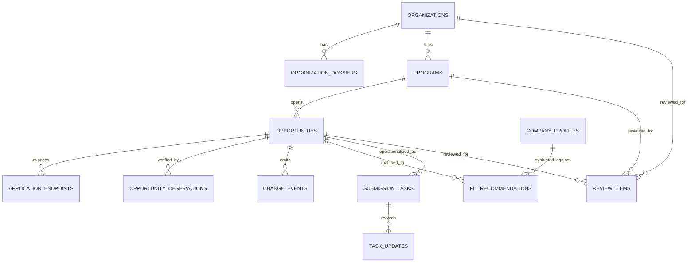

# 2026-03-07 Funding Intelligence Canonical Schema

## 1. Why This Pivot Exists

Current `fundlist` centers the product around `submission_target` rows and report generation.
That is too narrow for the actual goal.

The real product is not:

- a submission link scanner
- a markdown report generator
- a rule-only crawler

The real product is:

`an AI-driven funding intelligence and submission operations system`

That means the canonical data model must center on:

1. `organizations`
2. `programs`
3. `opportunities`
4. `organization dossiers`
5. `fit recommendations`
6. `submission tasks`

Links and deadlines are facts attached to opportunities, not the top-level entity.

## 2. Canonical Entity Model



## 3. Core Design Rules

1. `Organization` is the long-lived entity.
2. `Program` is the reusable funding vehicle run by an organization.
3. `Opportunity` is a time-bound application window or currently active intake state.
4. `ApplicationEndpoint` is the concrete form, page, email, or intake path.
5. `Observation` stores what was actually seen on a page at a point in time.
6. `Dossier` stores AI research about the organization/program, but must cite evidence.
7. `FitRecommendation` stores AI reasoning for a specific company/profile against a specific opportunity.
8. `SubmissionTask` stores operator state. It is never the same as the external opportunity.

## 4. Canonical SQL DDL

```sql
CREATE TABLE organizations (
  id TEXT PRIMARY KEY,
  canonical_name TEXT NOT NULL,
  normalized_name TEXT NOT NULL UNIQUE,
  organization_type TEXT NOT NULL,
  official_domain TEXT NOT NULL DEFAULT '',
  official_name TEXT NOT NULL DEFAULT '',
  short_description TEXT NOT NULL DEFAULT '',
  headquarters_region TEXT NOT NULL DEFAULT '',
  operating_status TEXT NOT NULL DEFAULT 'active',
  created_at TEXT NOT NULL,
  updated_at TEXT NOT NULL,
  last_researched_at TEXT NOT NULL DEFAULT ''
);

CREATE TABLE organization_aliases (
  id INTEGER PRIMARY KEY AUTOINCREMENT,
  organization_id TEXT NOT NULL,
  alias_name TEXT NOT NULL,
  alias_type TEXT NOT NULL DEFAULT 'discovered',
  confidence REAL NOT NULL DEFAULT 0.0,
  created_at TEXT NOT NULL,
  UNIQUE (organization_id, alias_name),
  FOREIGN KEY (organization_id) REFERENCES organizations(id)
);

CREATE TABLE organization_dossiers (
  id TEXT PRIMARY KEY,
  organization_id TEXT NOT NULL,
  version INTEGER NOT NULL,
  focus_sectors_json TEXT NOT NULL DEFAULT '[]',
  focus_stages_json TEXT NOT NULL DEFAULT '[]',
  focus_geographies_json TEXT NOT NULL DEFAULT '[]',
  check_size_min_usd INTEGER,
  check_size_max_usd INTEGER,
  fund_size_text TEXT NOT NULL DEFAULT '',
  ownership_terms_text TEXT NOT NULL DEFAULT '',
  thesis_summary TEXT NOT NULL DEFAULT '',
  investment_style TEXT NOT NULL DEFAULT '',
  decision_process TEXT NOT NULL DEFAULT '',
  preferred_company_types_json TEXT NOT NULL DEFAULT '[]',
  avoided_company_types_json TEXT NOT NULL DEFAULT '[]',
  portfolio_examples_json TEXT NOT NULL DEFAULT '[]',
  evidence_json TEXT NOT NULL DEFAULT '[]',
  confidence REAL NOT NULL DEFAULT 0.0,
  researched_at TEXT NOT NULL,
  generated_by_agent TEXT NOT NULL DEFAULT 'research-agent',
  FOREIGN KEY (organization_id) REFERENCES organizations(id)
);

CREATE TABLE programs (
  id TEXT PRIMARY KEY,
  organization_id TEXT NOT NULL,
  canonical_name TEXT NOT NULL,
  normalized_name TEXT NOT NULL,
  program_type TEXT NOT NULL,
  lifecycle_status TEXT NOT NULL DEFAULT 'active',
  summary TEXT NOT NULL DEFAULT '',
  official_page TEXT NOT NULL DEFAULT '',
  typical_award_text TEXT NOT NULL DEFAULT '',
  typical_equity_text TEXT NOT NULL DEFAULT '',
  geography_scope_json TEXT NOT NULL DEFAULT '[]',
  sector_scope_json TEXT NOT NULL DEFAULT '[]',
  stage_scope_json TEXT NOT NULL DEFAULT '[]',
  created_at TEXT NOT NULL,
  updated_at TEXT NOT NULL,
  last_researched_at TEXT NOT NULL DEFAULT '',
  UNIQUE (organization_id, normalized_name),
  FOREIGN KEY (organization_id) REFERENCES organizations(id)
);

CREATE TABLE opportunities (
  id TEXT PRIMARY KEY,
  program_id TEXT NOT NULL,
  opportunity_kind TEXT NOT NULL,
  label TEXT NOT NULL,
  status TEXT NOT NULL,
  opens_at TEXT NOT NULL DEFAULT '',
  deadline_at TEXT NOT NULL DEFAULT '',
  deadline_date TEXT NOT NULL DEFAULT '',
  deadline_text TEXT NOT NULL DEFAULT '',
  days_left INTEGER,
  award_text TEXT NOT NULL DEFAULT '',
  ticket_size_text TEXT NOT NULL DEFAULT '',
  currency_code TEXT NOT NULL DEFAULT '',
  official_page TEXT NOT NULL DEFAULT '',
  primary_submission_url TEXT NOT NULL DEFAULT '',
  submission_method TEXT NOT NULL DEFAULT '',
  summary TEXT NOT NULL DEFAULT '',
  requirements_text TEXT NOT NULL DEFAULT '',
  evidence_json TEXT NOT NULL DEFAULT '[]',
  confidence REAL NOT NULL DEFAULT 0.0,
  created_at TEXT NOT NULL,
  updated_at TEXT NOT NULL,
  last_checked_at TEXT NOT NULL,
  UNIQUE (program_id, label)
);

CREATE TABLE application_endpoints (
  id TEXT PRIMARY KEY,
  opportunity_id TEXT NOT NULL,
  endpoint_type TEXT NOT NULL,
  url TEXT NOT NULL,
  label TEXT NOT NULL DEFAULT '',
  is_primary INTEGER NOT NULL DEFAULT 0,
  is_official INTEGER NOT NULL DEFAULT 1,
  endpoint_status TEXT NOT NULL DEFAULT 'active',
  confidence REAL NOT NULL DEFAULT 0.0,
  evidence_json TEXT NOT NULL DEFAULT '[]',
  last_checked_at TEXT NOT NULL,
  UNIQUE (opportunity_id, url),
  FOREIGN KEY (opportunity_id) REFERENCES opportunities(id)
);

CREATE TABLE opportunity_observations (
  id TEXT PRIMARY KEY,
  opportunity_id TEXT NOT NULL,
  observed_url TEXT NOT NULL,
  observed_status TEXT NOT NULL,
  observed_deadline_date TEXT NOT NULL DEFAULT '',
  observed_deadline_text TEXT NOT NULL DEFAULT '',
  observed_submission_url TEXT NOT NULL DEFAULT '',
  observed_requirements_text TEXT NOT NULL DEFAULT '',
  page_title TEXT NOT NULL DEFAULT '',
  page_summary TEXT NOT NULL DEFAULT '',
  evidence_json TEXT NOT NULL DEFAULT '[]',
  html_snapshot_path TEXT NOT NULL DEFAULT '',
  screenshot_path TEXT NOT NULL DEFAULT '',
  confidence REAL NOT NULL DEFAULT 0.0,
  observed_at TEXT NOT NULL,
  observed_by_agent TEXT NOT NULL DEFAULT 'verification-agent',
  FOREIGN KEY (opportunity_id) REFERENCES opportunities(id)
);

CREATE TABLE company_profiles (
  id TEXT PRIMARY KEY,
  workspace_id TEXT NOT NULL,
  company_name TEXT NOT NULL,
  project_type TEXT NOT NULL DEFAULT '',
  sectors_json TEXT NOT NULL DEFAULT '[]',
  stages_json TEXT NOT NULL DEFAULT '[]',
  geographies_json TEXT NOT NULL DEFAULT '[]',
  product_summary TEXT NOT NULL DEFAULT '',
  raise_goal_text TEXT NOT NULL DEFAULT '',
  grant_goal_text TEXT NOT NULL DEFAULT '',
  traction_summary TEXT NOT NULL DEFAULT '',
  materials_json TEXT NOT NULL DEFAULT '[]',
  updated_at TEXT NOT NULL
);

CREATE TABLE fit_recommendations (
  id TEXT PRIMARY KEY,
  opportunity_id TEXT NOT NULL,
  company_profile_id TEXT NOT NULL,
  fit_score REAL NOT NULL,
  urgency_score REAL NOT NULL,
  expected_value_score REAL NOT NULL,
  overall_priority_score REAL NOT NULL,
  recommendation_status TEXT NOT NULL,
  why_fit TEXT NOT NULL,
  why_not_fit TEXT NOT NULL,
  recommended_ask TEXT NOT NULL,
  recommended_materials_json TEXT NOT NULL DEFAULT '[]',
  recommended_next_actions_json TEXT NOT NULL DEFAULT '[]',
  risk_flags_json TEXT NOT NULL DEFAULT '[]',
  evidence_json TEXT NOT NULL DEFAULT '[]',
  generated_at TEXT NOT NULL,
  generated_by_agent TEXT NOT NULL DEFAULT 'matching-agent',
  UNIQUE (opportunity_id, company_profile_id),
  FOREIGN KEY (opportunity_id) REFERENCES opportunities(id),
  FOREIGN KEY (company_profile_id) REFERENCES company_profiles(id)
);

CREATE TABLE change_events (
  id TEXT PRIMARY KEY,
  opportunity_id TEXT NOT NULL,
  change_type TEXT NOT NULL,
  before_json TEXT NOT NULL,
  after_json TEXT NOT NULL,
  change_summary TEXT NOT NULL,
  detected_at TEXT NOT NULL,
  detected_by_agent TEXT NOT NULL DEFAULT 'monitoring-agent',
  FOREIGN KEY (opportunity_id) REFERENCES opportunities(id)
);

CREATE TABLE submission_tasks (
  id TEXT PRIMARY KEY,
  opportunity_id TEXT NOT NULL,
  company_profile_id TEXT NOT NULL,
  owner TEXT NOT NULL DEFAULT '',
  task_status TEXT NOT NULL,
  due_at TEXT NOT NULL DEFAULT '',
  follow_up_at TEXT NOT NULL DEFAULT '',
  internal_notes TEXT NOT NULL DEFAULT '',
  submission_payload_path TEXT NOT NULL DEFAULT '',
  created_at TEXT NOT NULL,
  updated_at TEXT NOT NULL,
  FOREIGN KEY (opportunity_id) REFERENCES opportunities(id),
  FOREIGN KEY (company_profile_id) REFERENCES company_profiles(id)
);

CREATE TABLE task_updates (
  id TEXT PRIMARY KEY,
  task_id TEXT NOT NULL,
  update_type TEXT NOT NULL,
  update_text TEXT NOT NULL,
  actor TEXT NOT NULL,
  created_at TEXT NOT NULL,
  FOREIGN KEY (task_id) REFERENCES submission_tasks(id)
);

CREATE TABLE review_items (
  id TEXT PRIMARY KEY,
  target_kind TEXT NOT NULL,
  target_id TEXT NOT NULL,
  review_reason TEXT NOT NULL,
  severity TEXT NOT NULL,
  payload_json TEXT NOT NULL,
  status TEXT NOT NULL DEFAULT 'pending',
  created_at TEXT NOT NULL,
  resolved_at TEXT NOT NULL DEFAULT ''
);
```

## 5. Field-Level Truth Model

Each important field belongs to one of three categories.

### 5.1 Grounded Fact Fields

These require direct evidence from official or near-official sources.

- `status`
- `deadline_at`
- `deadline_date`
- `deadline_text`
- `primary_submission_url`
- `requirements_text`
- `official_page`
- `award_text`
- `ticket_size_text` if extracted directly from source

### 5.2 Research Fields

These can be produced by AI with web research, but must include evidence.

- `focus_sectors_json`
- `focus_stages_json`
- `thesis_summary`
- `investment_style`
- `decision_process`
- `portfolio_examples_json`
- `preferred_company_types_json`

### 5.3 Strategy Fields

These are agent reasoning outputs.

- `fit_score`
- `overall_priority_score`
- `why_fit`
- `recommended_ask`
- `recommended_next_actions_json`

## 6. Canonical JSON DTOs

Reference JSON schemas live here:

- [organization-dossier.schema.json](./schemas/organization-dossier.schema.json)
- [opportunity-card.schema.json](./schemas/opportunity-card.schema.json)
- [fit-recommendation.schema.json](./schemas/fit-recommendation.schema.json)
- [daily-brief.schema.json](./schemas/daily-brief.schema.json)

## 7. Migration Mapping From Current Tables

Current table -> new table mapping:

- `fundraising_records`
  - source seed records
  - initial material for `organizations`, `programs`, `organization_dossiers`
- `submission_targets`
  - partially maps into `opportunities`, `application_endpoints`, `opportunity_observations`
- `opportunity_changes`
  - maps into `change_events`
- `vc_submission_tasks`
  - maps into `submission_tasks`
- `scan_failures`
  - maps into `review_items`

### 7.1 What Must Change

1. stop using `submission_targets` as the top-level truth object
2. split stable organization identity from time-bound opportunity state
3. preserve every observation instead of overwriting fields silently
4. separate dossier research from opportunity verification
5. store AI recommendations separately from facts

## 8. Canonical Query Model

All product surfaces should be able to answer these questions without custom parsing:

1. Which organizations are relevant to our company profile?
2. Which programs exist under each organization?
3. Which opportunities are active right now?
4. Which ones are verified within the last 24 hours?
5. Which ones have deadlines within 3, 7, 14, 30 days?
6. Which ones fit our company best?
7. What should we ask from them?
8. What evidence supports each claim?

## 9. Acceptance Criteria For This Schema

This schema is correct only if it supports:

- one organization with many programs
- one program with many cohorts/windows over time
- many application endpoints per opportunity
- repeated verification over time
- AI dossier generation with evidence
- fit reasoning against one or more company profiles
- operator task management without mutating external facts

## 10. Immediate Implementation Consequence

Any future implementation should be rewritten in this order:

1. create new canonical tables
2. write migration adapters from `fundraising_records` and `submission_targets`
3. add organization dossier generation
4. add opportunity observation and reconciliation pipeline
5. add fit recommendation generation
6. rebuild Telegram/API output on these DTOs
