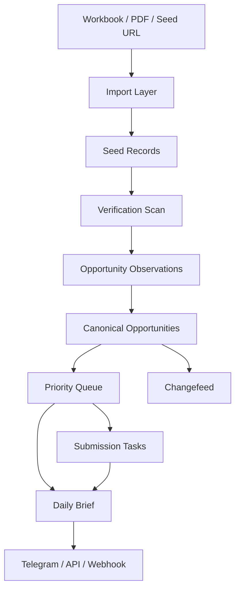

# Implementation Blueprint

## 1. Purpose

이 문서는 현재 `fundlist` 코드베이스를 기준으로,

- `verified opportunity engine`
- `continuous update loop`
- `submission ops layer`
- `internal/public API`

를 실제로 구현하기 위한 청사진이다.

목표는 "좋은 아이디어"를 적는 것이 아니라, 바로 코드를 나눠서 구현할 수 있게 만드는 것이다.

## 2. Current Baseline

현재 이미 있는 것:

- `fundraising.py`
  - xlsx/pdf import
- `submission_finder.py`
  - official page / submission link / status / deadline 추출
- `vc_ops.py`
  - submission queue / digest용 운영 로직
- `scripts/vc_ops_cron.sh`
  - daily run
- `scripts/push_telegram_reports.py`
  - Telegram digest
- `scripts/telegram_bot.py`
  - 수동 실행 명령

즉, 현재 시스템은 이미 아래 두 축을 갖고 있다.

1. `verification`
2. `operator delivery`

빠져 있는 것은 아래 두 축이다.

1. `submission task management`
2. `API service / job boundary`

## 3. Target State

구현 후 시스템은 아래 흐름으로 돌아가야 한다.

핵심 원칙:

- `Opportunity`는 외부 세계의 사실
- `Submission Task`는 내부 운영 상태
- `Brief`는 사실 + 추론의 조합
- `API`는 DB와 워커 사이의 제어면

## 4. Scope Freeze

이번 구현 범위는 아래로 고정한다.

### Included

- accelerator
- grant
- ecosystem program
- 일부 open-application VC
- direct apply link detection
- deadline extraction
- task lifecycle
- internal FastAPI
- Telegram/API parity

### Excluded

- auto submit
- captcha solving
- login/session automation
- cold outreach automation
- investor CRM full replacement

## 5. Codebase Refactor Map

현재 파일을 기준으로 어디를 유지하고 어디를 추가할지 정한다.

### Keep As Core

- [fundraising.py](/Users/ej/Downloads/문서/VC_Fundraising/VC%20list/fundlist-git/src/fundlist/fundraising.py)
- [submission_finder.py](/Users/ej/Downloads/문서/VC_Fundraising/VC%20list/fundlist-git/src/fundlist/submission_finder.py)
- [vc_ops.py](/Users/ej/Downloads/문서/VC_Fundraising/VC%20list/fundlist-git/src/fundlist/vc_ops.py)
- [cli.py](/Users/ej/Downloads/문서/VC_Fundraising/VC%20list/fundlist-git/src/fundlist/cli.py)
- [telegram_bot.py](/Users/ej/Downloads/문서/VC_Fundraising/VC%20list/fundlist-git/scripts/telegram_bot.py)

### Add

- `src/fundlist/submission_tasks.py`
- `src/fundlist/changefeed.py`
- `src/fundlist/priority.py`
- `src/fundlist/workspaces.py`
- `src/fundlist/briefs.py`
- `src/fundlist/jobs.py`
- `src/fundlist/api/app.py`
- `src/fundlist/api/schemas.py`
- `src/fundlist/api/deps.py`
- `src/fundlist/browser_retry.py` (phase 2)

### Optional Later

- `src/fundlist/ai_reasoning.py`
- `src/fundlist/webhooks.py`
- `src/fundlist/browser_worker.py`

## 6. Database Plan

현재 SQLite 기반을 유지하되, 스키마를 늘려서 internal production-like mode를 만든다.

### 6.1 Keep Existing Tables

- `investment_items`
- `fundraising_records`
- `vc_submission_tasks`
- `vc_ops_events`
- `vc_ops_snapshots`
- `submission_targets`

### 6.2 Add New Tables

#### `submission_tasks`

역할:

- 실제 운영 task 관리

필드:

- `id INTEGER PRIMARY KEY`
- `workspace_key TEXT NOT NULL DEFAULT 'default'`
- `opportunity_fingerprint TEXT NOT NULL`
- `org_name TEXT NOT NULL`
- `program_name TEXT NOT NULL DEFAULT ''`
- `official_page TEXT NOT NULL DEFAULT ''`
- `submission_url TEXT NOT NULL DEFAULT ''`
- `opportunity_status TEXT NOT NULL DEFAULT ''`
- `submission_state TEXT NOT NULL`
- `owner TEXT NOT NULL DEFAULT ''`
- `due_date TEXT NOT NULL DEFAULT ''`
- `priority_score INTEGER NOT NULL DEFAULT 0`
- `fit_score INTEGER NOT NULL DEFAULT 0`
- `recommended_action TEXT NOT NULL DEFAULT ''`
- `notes TEXT NOT NULL DEFAULT ''`
- `created_at TEXT NOT NULL`
- `updated_at TEXT NOT NULL`
- `submitted_at TEXT NOT NULL DEFAULT ''`
- `follow_up_due_at TEXT NOT NULL DEFAULT ''`

인덱스:

- `(workspace_key, submission_state, updated_at DESC)`
- `(workspace_key, due_date, priority_score DESC)`
- `(opportunity_fingerprint)`

#### `submission_task_updates`

역할:

- task activity log

필드:

- `id INTEGER PRIMARY KEY`
- `task_id INTEGER NOT NULL`
- `event_type TEXT NOT NULL`
- `body TEXT NOT NULL`
- `actor TEXT NOT NULL DEFAULT 'system'`
- `created_at TEXT NOT NULL`

인덱스:

- `(task_id, created_at DESC)`

#### `opportunity_changes`

역할:

- changefeed source

필드:

- `id INTEGER PRIMARY KEY`
- `workspace_key TEXT NOT NULL DEFAULT 'default'`
- `fingerprint TEXT NOT NULL`
- `org_name TEXT NOT NULL`
- `change_type TEXT NOT NULL`
- `old_value TEXT NOT NULL DEFAULT ''`
- `new_value TEXT NOT NULL DEFAULT ''`
- `source_url TEXT NOT NULL DEFAULT ''`
- `submission_url TEXT NOT NULL DEFAULT ''`
- `detected_at TEXT NOT NULL`

인덱스:

- `(workspace_key, detected_at DESC)`
- `(fingerprint, detected_at DESC)`
- `(change_type, detected_at DESC)`

#### `workspace_profiles`

초기에는 간단한 single-table 형태로 간다.

필드:

- `workspace_key TEXT PRIMARY KEY`
- `company_name TEXT NOT NULL DEFAULT ''`
- `thesis_text TEXT NOT NULL DEFAULT ''`
- `sector_tags TEXT NOT NULL DEFAULT ''`
- `stage_tags TEXT NOT NULL DEFAULT ''`
- `geo_tags TEXT NOT NULL DEFAULT ''`
- `program_type_tags TEXT NOT NULL DEFAULT ''`
- `excluded_orgs TEXT NOT NULL DEFAULT ''`
- `timezone TEXT NOT NULL DEFAULT 'Asia/Seoul'`
- `created_at TEXT NOT NULL`
- `updated_at TEXT NOT NULL`

#### `job_runs`

역할:

- API와 워커 사이 상태 관리

필드:

- `id INTEGER PRIMARY KEY`
- `workspace_key TEXT NOT NULL DEFAULT 'default'`
- `job_type TEXT NOT NULL`
- `status TEXT NOT NULL`
- `payload_json TEXT NOT NULL`
- `result_json TEXT NOT NULL DEFAULT '{}'`
- `error_text TEXT NOT NULL DEFAULT ''`
- `started_at TEXT NOT NULL`
- `finished_at TEXT NOT NULL DEFAULT ''`

인덱스:

- `(workspace_key, job_type, started_at DESC)`
- `(status, started_at DESC)`

## 7. Store Layer Changes

현재 [store.py](/Users/ej/Downloads/문서/VC_Fundraising/VC%20list/fundlist-git/src/fundlist/store.py)는 `investment_items` 전용이다.

이제 두 방향 중 하나를 고른다.

### Recommended

- `store.py`는 공통 helper만 유지
- 도메인별 store를 분리

추가 파일:

- `submission_task_store.py`
- `workspace_store.py`
- `job_store.py`
- `changefeed_store.py`

이유:

- 지금부터 하나의 `SQLiteStore`에 다 넣으면 금방 비대해진다.

### Migration Rule

- 기존 테이블을 건드리는 migration은 additive only
- destructive migration 없음
- `_ensure_column` 스타일을 유지

## 8. Verification Engine Work

현재 [submission_finder.py](/Users/ej/Downloads/문서/VC_Fundraising/VC%20list/fundlist-git/src/fundlist/submission_finder.py)는 이미 핵심이다.

추가해야 하는 것:

### 8.1 Change Detection

스캔 후 각 row에 대해 이전 관측값과 비교:

- `status`
- `deadline_date`
- `submission_url`
- `source_url`

변경 시 `opportunity_changes`에 기록.

### 8.2 Stable Fingerprint Contract

`fingerprint`는 아래 우선순위로 안정화:

1. canonicalized submission_url
2. canonicalized source_url + org_name
3. domain + normalized org/program

이 규칙을 고정해야 changefeed 품질이 올라간다.

### 8.3 Confidence Score

현재 `score`와 별개로 `confidence` 개념을 도입한다.

권장 규칙:

- direct official form + explicit status + parsed deadline: 90+
- official domain + apply path + strong wording: 75~89
- form host only + weak wording: 60~74
- no explicit markers: <60

### 8.4 Review Flags

다음 조건이면 review flag를 붙인다.

- status = `unknown`
- confidence < 70
- deadline_text exists but date parse missing
- source_url exists but submission_url missing
- same org with multiple conflicting URLs

## 9. Priority Layer

새 파일:

- `src/fundlist/priority.py`

역할:

- `submission_targets`
- `workspace_profile`
- `recent_changes`

를 입력으로 받아 `priority_queue`를 계산

### 9.1 Score Breakdown

최종 `priority_score`는 아래 합으로 계산:

- `trust_score` 0~30
- `urgency_score` 0~30
- `fit_score` 0~20
- `readiness_score` 0~15
- `change_boost` 0~5

### 9.2 Trust Score

- official domain: +8
- direct apply/form URL: +8
- explicit closed/open/deadline marker: +6
- confidence >= 85: +5
- verified within 24h: +3

### 9.3 Urgency Score

- D0~D3: +30
- D4~D7: +24
- D8~D14: +16
- rolling/open without deadline: +8
- closed: 0

### 9.4 Fit Score

초기에는 규칙 기반:

- sector tag match
- stage tag match
- geo tag match
- preferred program type match
- excluded org penalty

### 9.5 Readiness Score

- submission_url exists: +6
- requirements extracted: +3
- form submission type: +3
- owner already assigned: +1
- no blockers note: +2

## 10. Submission Task Layer

새 파일:

- `src/fundlist/submission_tasks.py`

역할:

- task CRUD
- list views
- state transitions
- due/follow-up calculations

### 10.1 States

- `not_started`
- `researching`
- `drafting`
- `waiting_assets`
- `ready_to_submit`
- `submitted`
- `follow_up_due`
- `won`
- `rejected`
- `archived`

### 10.2 Allowed Transitions

- `not_started -> researching`
- `researching -> drafting`
- `drafting -> waiting_assets`
- `waiting_assets -> ready_to_submit`
- `ready_to_submit -> submitted`
- `submitted -> follow_up_due`
- `submitted -> won`
- `submitted -> rejected`
- any -> archived

### 10.3 Commands To Add

CLI additions in [cli.py](/Users/ej/Downloads/문서/VC_Fundraising/VC%20list/fundlist-git/src/fundlist/cli.py):

- `task-create`
- `task-list`
- `task-update`
- `task-view`
- `task-add-note`
- `task-ready`
- `task-submitted`
- `task-followup`

### 10.4 Derived Views

- `task-list --bucket ready`
- `task-list --bucket submitted`
- `task-list --bucket followup`
- `task-list --bucket blocked`

## 11. Changefeed Layer

새 파일:

- `src/fundlist/changefeed.py`

역할:

- 최근 변경 조회
- Telegram/API/webhook에서 재사용

### 11.1 Change Types

- `status_changed`
- `deadline_changed`
- `submission_url_changed`
- `source_url_changed`
- `reopened`
- `new_opportunity`

### 11.2 Commands To Add

- `changes-list`
- `changes-report`

## 12. Brief Generation

새 파일:

- `src/fundlist/briefs.py`

역할:

- factual brief body
- AI optional overlay

### 12.1 Morning Brief Sections

1. top priorities
2. deadline this week
3. apply open
4. changed today
5. ready to submit
6. review needed

### 12.2 Evening Brief Sections

1. new/changed since morning
2. tomorrow deadlines
3. blocked tasks
4. follow-up due

### 12.3 Source Of Truth

- opportunities
- priority queue
- submission tasks
- changefeed

## 13. Telegram Layer Changes

현재 [telegram_bot.py](/Users/ej/Downloads/문서/VC_Fundraising/VC%20list/fundlist-git/scripts/telegram_bot.py)는 scan/report 중심이다.

추가할 명령:

- `/task_create <keyword>`
- `/task_ready <task-id>`
- `/task_submitted <task-id>`
- `/tasks_ready`
- `/tasks_followup`
- `/changes_today`
- `/review_queue`

### 13.1 Telegram Design Rule

Telegram은 heavy workflow editor가 아니라 `operator console`로 둔다.

즉:

- list / trigger / quick update는 Telegram
- bulk edit / dashboard는 API 또는 later UI

## 14. API Phase 1

새 파일:

- `src/fundlist/api/app.py`
- `src/fundlist/api/schemas.py`
- `src/fundlist/api/deps.py`

FastAPI 초기 목표:

- internal use only
- single workspace first
- bearer token 단일 env 기반

### 14.1 Endpoints

#### `GET /health`

기본 상태.

#### `GET /opportunities`

query:

- `status`
- `min_priority_score`
- `deadline_to`
- `limit`
- `cursor`

#### `GET /opportunities/{fingerprint}`

상세 사실 + 최근 변경 + 연결된 task

#### `GET /changes`

query:

- `since`
- `change_type`
- `limit`

#### `GET /tasks`

query:

- `submission_state`
- `bucket`
- `owner`
- `limit`

#### `POST /tasks`

body:

- `fingerprint`
- `owner`
- `due_date`
- `notes`

#### `PATCH /tasks/{id}`

body:

- `submission_state`
- `owner`
- `due_date`
- `notes`

#### `POST /tasks/{id}/submitted`

body:

- `submitted_at`
- `notes`

#### `POST /scans/full`

job trigger

#### `POST /scans/delta`

job trigger

#### `GET /briefs/latest`

query:

- `kind=morning|evening`

## 15. Jobs And Scheduling

새 파일:

- `src/fundlist/jobs.py`

역할:

- job creation
- job execution wrapper
- run history

### 15.1 Job Types

- `import`
- `scan_full`
- `scan_delta`
- `priority_rebuild`
- `brief_morning`
- `brief_evening`
- `unknown_retry`

### 15.2 Initial Runtime

초기엔 external queue 없이 process-local command wrapper로 시작한다.

즉:

- API `POST /scans/full`
- 내부에서 `job_runs` row 생성
- subprocess or direct function call 실행
- 결과 저장

이후에 Redis/Celery로 분리 가능하게 인터페이스만 맞춘다.

### 15.3 Schedule

- `morning`: full or delta + priority + brief
- `midday`: program-specific/manual
- `evening`: delta + unknown retry + brief
- `near-deadline`: small frequent delta

## 16. Review Queue

phase 2지만 지금 설계부터 들어가야 한다.

### 16.1 Rule Inputs

- `status = unknown`
- `confidence < 70`
- missing submission_url
- ambiguous deadline
- duplicate candidates
- conflicting recent changes

### 16.2 Output

review queue item:

- `fingerprint`
- `org_name`
- `reason`
- `suggested_action`
- `source_url`
- `submission_url`
- `last_checked_at`

### 16.3 Commands

- `review-list`
- `review-resolve`
- `review-ignore`

## 17. AI Layer Phase 2

초기에는 AI를 verification에 넣지 않는다.

넣는 위치:

- `daily brief summary`
- `priority_reason`
- `next_action`
- `blocker extraction`

새 파일:

- `src/fundlist/ai_reasoning.py`

### 17.1 Inputs

- verified facts only
- task state
- workspace profile

### 17.2 Outputs

- `priority_reason`
- `next_action`
- `brief_summary`

### 17.3 Guardrails

- AI가 status 수정 금지
- AI가 deadline_date 생성 금지
- AI output must be optional

## 18. Testing Plan

### 18.1 Unit Tests

추가 디렉토리:

- `tests/test_submission_tasks.py`
- `tests/test_changefeed.py`
- `tests/test_priority.py`
- `tests/test_api_opportunities.py`
- `tests/test_api_tasks.py`

### 18.2 Golden Fixtures

고정 fixture가 필요하다.

- open form page
- closed google form
- deadline page
- rolling page
- ambiguous page

### 18.3 Contract Tests

API response schema snapshot tests

### 18.4 Migration Tests

기존 DB 파일에 대해 additive migration이 깨지지 않는지 검사

## 19. Observability

필수 로그:

- scan started/finished
- sites scanned
- hits found
- changes recorded
- tasks created/updated
- briefs generated
- Telegram/API delivery result

필수 지표:

- scan duration
- hit rate
- unknown rate
- change rate
- direct apply link coverage
- task conversion rate

## 20. Security

Phase 1:

- single bearer token env
- localhost bind only
- no public exposure by default

Phase 2:

- API key table
- per-workspace auth
- webhook secret signing

## 21. Rollout Order

### Milestone 1

`submission task layer`

완료 기준:

- CLI로 task 생성/조회/업데이트
- Telegram에서 ready/submitted/followup 조회

### Milestone 2

`changefeed`

완료 기준:

- 스캔 후 변경분 기록
- changes report / Telegram report

### Milestone 3

`priority module split`

완료 기준:

- priority 계산이 `vc_ops.py`에서 분리
- task와 opportunity 양쪽에서 재사용

### Milestone 4

`FastAPI Phase 1`

완료 기준:

- opportunities/changes/tasks/briefs/scans API 동작

### Milestone 5

`review queue`

완료 기준:

- unknown/low confidence 재검토 루프 작동

### Milestone 6

`AI reasoning`

완료 기준:

- AI daily summary, priority reason, next action

## 22. Immediate Build Queue

다음 구현은 이 순서로 고정하는 게 맞다.

1. `submission_tasks.py` + new tables
2. CLI `task-*` commands
3. Telegram `tasks_*` commands
4. `changefeed.py`
5. API `GET /tasks`, `POST /tasks`
6. API `GET /opportunities`, `GET /changes`

이렇게 해야 "운영 가치"가 빠르게 생긴다.

## 23. Done Criteria

이 블루프린트 기준으로 MVP가 끝났다고 말하려면 아래가 모두 돼야 한다.

1. seed import가 매일 갱신된다
2. verified opportunity list가 생성된다
3. changed items가 따로 보인다
4. ready-to-submit queue가 있다
5. submitted / follow-up queue가 있다
6. Telegram과 API가 같은 truth를 본다
7. 사람 검토가 필요한 항목이 review queue로 분리된다

## 24. Bottom Line

지금부터의 구현은 `AI agent`를 만드는 것이 아니라,

- `verification engine`
- `submission operations system`
- `change monitoring service`
- `internal API`

를 순서대로 굳히는 작업이다.

그리고 가장 먼저 만들 것은 `submission task layer`다.
