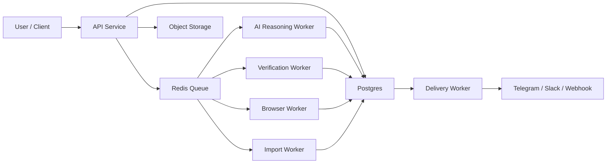

# VC Agent API Detailed Spec

## 1. Goal

이 문서는 `VC/Accelerator/Grant opportunity verification + prioritization + submission management`를 API 제품으로 만들기 위한 상세 설계다.

목표는 아래 세 가지를 동시에 만족하는 것이다.

1. 고객이 API로 `검증된 기회 목록`을 호출할 수 있어야 한다.
2. 고객이 `지속적인 업데이트`를 webhook / polling / bot push로 받을 수 있어야 한다.
3. 고객이 단순 조회를 넘어서 `제출 준비, 제출 진행, follow-up`까지 관리할 수 있어야 한다.

즉, 이 제품은 `정보 조회 API`가 아니라 `VC application operations platform`이다.

## 2. Product Promise

고객에게 제공하는 약속은 아래 4개다.

1. 공식 페이지 기준으로 검증된 링크를 제공한다.
2. 상태(`open`, `rolling`, `deadline`, `closed`, `unknown`)를 추적한다.
3. 고객 프로필 기준으로 우선순위를 계산한다.
4. 제출 운영 상태를 큐로 관리하고 변경사항을 계속 업데이트한다.

## 3. User Types

### 3.1 Founder / Fundraising Team

원하는 것:

- 지금 신청 가능한 프로그램 목록
- 이번 주 마감 목록
- 직접 제출 링크
- 제출 준비 상태 관리

### 3.2 Internal Ops Team

원하는 것:

- 여러 회사/프로젝트의 파이프라인 관리
- 제출 담당자 지정
- follow-up 히스토리
- daily brief

### 3.3 SaaS / Third-Party Integrator

원하는 것:

- API 호출
- webhook 이벤트 수신
- white-label dashboard integration

## 4. Product Scope

### In Scope

- opportunity verification
- deadline extraction
- fit/priority scoring
- submission task management
- daily/weekly briefs
- Telegram/Slack/webhook delivery
- workspace-specific customization

### Out of Scope For MVP

- 실제 폼 자동 제출
- 법적 문서 검토
- CRM 전체 대체
- cap table / diligence room full management

`자동 제출`은 위험이 크고 사이트별 예외가 많아서 초기 제품에서는 제외한다.
초기 제품은 `제출 가능한 상태까지 정리하고 관리`하는 데 집중한다.

## 5. Product Architecture



핵심 분리:

- `API Service`
  - 인증, CRUD, 조회, job 생성
- `Verification Worker`
  - 사이트 방문, 링크/상태 추출
- `Browser Worker`
  - JS-heavy 사이트 재검증
- `AI Worker`
  - fit/priority/daily brief 생성
- `Delivery Worker`
  - push 발송

## 6. Core Principles

### 6.1 Fact and Inference Must Be Separated

반드시 아래 둘을 구분해야 한다.

- `facts`
  - official_page
  - submission_url
  - status
  - deadline_date
  - verified_at
  - evidence
- `inference`
  - fit_score
  - priority_score
  - priority_reason
  - recommended_action

### 6.2 Verification Is Deterministic First

상태 판정은 우선 코드와 근거 기반으로 처리한다.

순서:

1. explicit closed marker
2. explicit deadline marker
3. explicit rolling/open marker
4. actionable submission link
5. otherwise unknown

### 6.3 AI Cannot Invent Facts

AI는 아래만 허용한다.

- fit analysis
- ambiguous requirements summary
- prioritization rationale
- next action generation

AI는 아래를 하면 안 된다.

- 근거 없는 status 확정
- 날짜 추측
- official_page 없는 링크 추천

### 6.4 Every Record Needs Freshness

모든 opportunity는 반드시 아래를 가진다.

- `verified_at`
- `verification_method`
- `verification_confidence`

## 7. Domain Model

### 7.1 workspace

고객/팀 단위 최상위 엔터티.

필드:

- `workspace_id`
- `name`
- `slug`
- `plan`
- `status`
- `created_at`
- `updated_at`

### 7.2 workspace_profile

고객 전략 정의.

필드:

- `workspace_id`
- `company_name`
- `company_description`
- `sector_tags`
- `stage_tags`
- `geo_tags`
- `check_size_min`
- `check_size_max`
- `preferred_program_types`
- `excluded_orgs`
- `thesis_text`
- `delivery_preferences`
- `daily_brief_hour_local`
- `timezone`

### 7.3 source_document

원본 업로드 파일 메타데이터.

필드:

- `source_document_id`
- `workspace_id`
- `kind` (`xlsx`, `csv`, `pdf`, `md`)
- `filename`
- `storage_key`
- `sha256`
- `uploaded_at`

### 7.4 import_run

파일 import 실행 단위.

필드:

- `import_run_id`
- `workspace_id`
- `source_document_id`
- `status`
- `rows_seen`
- `rows_imported`
- `errors_json`
- `started_at`
- `finished_at`

### 7.5 seed_record

원본 row 또는 사용자 입력 URL.

필드:

- `seed_record_id`
- `workspace_id`
- `import_run_id`
- `source_kind`
- `source_ref`
- `org_name_hint`
- `program_name_hint`
- `url_hint`
- `raw_text`
- `raw_json`
- `normalized_key`

### 7.6 verification_run

스캔 단위.

필드:

- `verification_run_id`
- `workspace_id`
- `mode` (`full`, `delta`, `program`, `manual`)
- `status`
- `seed_count`
- `page_fetch_count`
- `hit_count`
- `error_count`
- `started_at`
- `finished_at`

### 7.7 opportunity

canonical deduped target.

필드:

- `opportunity_id`
- `workspace_id`
- `org_name`
- `program_name`
- `org_type`
- `domain`
- `canonical_key`
- `current_status`
- `current_official_page`
- `current_submission_url`
- `current_deadline_date`
- `current_deadline_text`
- `current_requirements`
- `current_confidence`
- `first_seen_at`
- `last_verified_at`
- `last_changed_at`

### 7.8 opportunity_observation

각 검증 시점의 스냅샷.

필드:

- `observation_id`
- `opportunity_id`
- `verification_run_id`
- `official_page`
- `submission_url`
- `submission_type`
- `status`
- `deadline_text`
- `deadline_date`
- `requirements`
- `evidence`
- `source_page_snapshot`
- `verification_method`
- `confidence`
- `observed_at`

### 7.9 opportunity_tag

필드:

- `opportunity_id`
- `tag_type` (`sector`, `stage`, `geo`, `program_type`, `ecosystem`)
- `tag_value`

### 7.10 priority_queue_item

workspace별 우선순위 결과.

필드:

- `priority_queue_item_id`
- `workspace_id`
- `opportunity_id`
- `fit_score`
- `trust_score`
- `urgency_score`
- `readiness_score`
- `priority_score`
- `priority_reason`
- `deadline_bucket`
- `recommended_action`
- `recommended_owner`
- `rebuilt_at`

### 7.11 submission_task

실제 운영용 task.

필드:

- `submission_task_id`
- `workspace_id`
- `opportunity_id`
- `status`
- `owner_user_id`
- `due_date`
- `submission_state`
- `submission_url_snapshot`
- `notes`
- `created_at`
- `updated_at`

권장 `submission_state` enum:

- `not_started`
- `researching`
- `drafting`
- `waiting_assets`
- `ready_to_submit`
- `submitted`
- `follow_up_due`
- `won`
- `rejected`
- `archived`

### 7.12 submission_task_update

task activity log.

필드:

- `submission_task_update_id`
- `submission_task_id`
- `event_type`
- `body`
- `actor_type`
- `actor_id`
- `created_at`

### 7.13 brief

daily/weekly digest.

필드:

- `brief_id`
- `workspace_id`
- `kind` (`daily_morning`, `daily_evening`, `weekly`)
- `facts_json`
- `inference_json`
- `markdown_body`
- `generated_at`

### 7.14 delivery_endpoint

push destination.

필드:

- `delivery_endpoint_id`
- `workspace_id`
- `channel` (`telegram`, `slack`, `webhook`, `email`)
- `target_ref`
- `secret_ref`
- `status`
- `last_sent_at`

### 7.15 api_key

필드:

- `api_key_id`
- `workspace_id`
- `label`
- `hashed_secret`
- `scopes`
- `rate_limit_tier`
- `created_at`
- `last_used_at`
- `revoked_at`

## 8. Status Model

### 8.1 Opportunity Status

- `open`
- `rolling`
- `deadline`
- `closed`
- `unknown`

정의:

- `open`: 신청 가능, deadline 불명확
- `rolling`: rolling/open wording 존재
- `deadline`: 명시적 deadline 존재
- `closed`: 닫힘이 명시됨
- `unknown`: 판정 근거 부족

### 8.2 Verification Confidence

0~100 score.

예:

- 95+: official domain + direct form + explicit status marker
- 80+: official domain + clear apply page + parsed deadline
- 60+: official domain + likely apply link but weaker evidence
- <60: ambiguous, review recommended

## 9. API Conventions

### 9.1 Auth

헤더:

`Authorization: Bearer <api_key>`

### 9.2 Idempotency

모든 job 생성/업로드 엔드포인트는 아래 헤더 지원:

`Idempotency-Key: <uuid>`

### 9.3 Pagination

cursor 기반.

응답:

```json
{
  "items": [],
  "next_cursor": "cur_123",
  "has_more": true
}
```

### 9.4 Error Shape

```json
{
  "error": {
    "code": "invalid_request",
    "message": "workspace_id is required",
    "request_id": "req_123"
  }
}
```

## 10. API Surface

## 10.1 Workspace APIs

### POST /v1/workspaces

workspace 생성.

request:

```json
{
  "name": "Reechewclow",
  "timezone": "Asia/Seoul",
  "plan": "pro"
}
```

response:

```json
{
  "workspace_id": "ws_123",
  "name": "Reechewclow",
  "timezone": "Asia/Seoul",
  "plan": "pro",
  "status": "active"
}
```

### GET /v1/workspaces/{workspace_id}

workspace 조회.

### PATCH /v1/workspaces/{workspace_id}/profile

customer thesis 업데이트.

request:

```json
{
  "company_name": "Example Labs",
  "sector_tags": ["ai", "crypto", "infrastructure"],
  "stage_tags": ["pre-seed", "seed"],
  "geo_tags": ["global", "apac", "us"],
  "preferred_program_types": ["accelerator", "grant", "vc"],
  "thesis_text": "AI + crypto infra, developer tooling, early-stage"
}
```

## 10.2 Source APIs

### POST /v1/workspaces/{workspace_id}/sources/files

multipart upload.

response:

```json
{
  "source_document_id": "src_123",
  "kind": "xlsx",
  "filename": "2025-2026 Fund Raising.xlsx",
  "status": "uploaded"
}
```

### POST /v1/workspaces/{workspace_id}/sources/urls

수동 시드 등록.

request:

```json
{
  "items": [
    {
      "org_name_hint": "Alliance",
      "program_name_hint": "Alliance DAO",
      "url": "https://alliance.xyz/apply"
    }
  ]
}
```

### POST /v1/workspaces/{workspace_id}/imports/run

파일 import job 생성.

request:

```json
{
  "source_document_ids": ["src_123", "src_124"]
}
```

response:

```json
{
  "job_id": "job_import_123",
  "status": "queued"
}
```

## 10.3 Verification APIs

### POST /v1/workspaces/{workspace_id}/scans

검증 스캔 job 생성.

request:

```json
{
  "mode": "full",
  "seed_scope": "all",
  "max_sites": 500,
  "max_pages_per_site": 4,
  "skip_search": true
}
```

`mode`:

- `full`
- `delta`
- `program`
- `manual`

response:

```json
{
  "job_id": "job_scan_123",
  "verification_run_id": "vr_123",
  "status": "queued"
}
```

### GET /v1/workspaces/{workspace_id}/scans/{verification_run_id}

응답:

```json
{
  "verification_run_id": "vr_123",
  "mode": "full",
  "status": "running",
  "seed_count": 2135,
  "page_fetch_count": 381,
  "hit_count": 74,
  "error_count": 12,
  "started_at": "2026-03-07T01:00:00Z",
  "finished_at": null
}
```

### POST /v1/workspaces/{workspace_id}/opportunities/{opportunity_id}/reverify

특정 opportunity 재검증.

### GET /v1/workspaces/{workspace_id}/opportunities

필터:

- `status`
- `deadline_from`
- `deadline_to`
- `program_type`
- `min_priority_score`
- `min_fit_score`
- `q`
- `sort`

예:

`GET /v1/workspaces/ws_123/opportunities?status=deadline&deadline_to=2026-03-14&sort=priority_desc`

response item:

```json
{
  "opportunity_id": "opp_123",
  "org_name": "Alliance",
  "program_name": "Alliance DAO",
  "org_type": "Accelerator",
  "facts": {
    "official_page": "https://alliance.xyz/apply",
    "submission_url": "https://alliance.xyz/apply",
    "status": "deadline",
    "deadline_text": "Applications close March 25, 2026",
    "deadline_date": "2026-03-25",
    "requirements": "deck requested",
    "verified_at": "2026-03-07T00:55:00Z",
    "confidence": 92,
    "evidence": [
      "path:apply",
      "url:direct-form",
      "phrase:apply now"
    ]
  },
  "inference": {
    "fit_score": 88,
    "trust_score": 92,
    "urgency_score": 77,
    "readiness_score": 81,
    "priority_score": 90,
    "priority_reason": "crypto accelerator, direct application page, near deadline"
  }
}
```

### GET /v1/workspaces/{workspace_id}/opportunities/{opportunity_id}

상세 조회.

추가 포함:

- observation history
- source documents
- task summary

## 10.4 Priority APIs

### POST /v1/workspaces/{workspace_id}/priorities/rebuild

workspace profile 기준 우선순위 재계산.

response:

```json
{
  "job_id": "job_priority_123",
  "status": "queued"
}
```

### GET /v1/workspaces/{workspace_id}/priorities

정렬된 큐 조회.

필터:

- `bucket=today|this_week|later|no_deadline|closed|unknown`
- `owner`
- `min_priority_score`

## 10.5 Submission Management APIs

### POST /v1/workspaces/{workspace_id}/tasks

opportunity를 실제 task로 전환.

request:

```json
{
  "opportunity_id": "opp_123",
  "owner_user_id": "user_123",
  "due_date": "2026-03-20",
  "submission_state": "researching",
  "notes": "Need updated deck and AI narrative"
}
```

### GET /v1/workspaces/{workspace_id}/tasks

필터:

- `submission_state`
- `owner_user_id`
- `due_before`
- `opportunity_status`

### PATCH /v1/workspaces/{workspace_id}/tasks/{task_id}

request:

```json
{
  "submission_state": "ready_to_submit",
  "notes": "Deck uploaded, answers drafted"
}
```

### POST /v1/workspaces/{workspace_id}/tasks/{task_id}/updates

request:

```json
{
  "event_type": "note",
  "body": "Founder review completed."
}
```

### POST /v1/workspaces/{workspace_id}/tasks/{task_id}/submit-ready

의미:

- 시스템이 form auto-submit을 하는 게 아니라
- task를 `ready_to_submit` 상태로 고정하고 audit log 남김

초기 제품에서 실제 submit click은 하지 않는다.

### POST /v1/workspaces/{workspace_id}/tasks/{task_id}/submitted

request:

```json
{
  "submitted_at": "2026-03-07T09:00:00+09:00",
  "notes": "Submitted by founder via official form"
}
```

## 10.6 Brief APIs

### POST /v1/workspaces/{workspace_id}/briefs/daily

daily brief 생성.

request:

```json
{
  "kind": "daily_morning"
}
```

response:

```json
{
  "job_id": "job_brief_123",
  "status": "queued"
}
```

### GET /v1/workspaces/{workspace_id}/briefs/latest?kind=daily_morning

응답:

```json
{
  "brief_id": "brief_123",
  "kind": "daily_morning",
  "generated_at": "2026-03-07T00:59:00Z",
  "facts": {
    "open_count": 28,
    "deadline_this_week": 6,
    "closed_count": 4,
    "unknown_count": 9
  },
  "inference": {
    "top_3": [
      {
        "opportunity_id": "opp_123",
        "reason": "near deadline + strong fit"
      }
    ]
  },
  "markdown_body": "..."
}
```

## 10.7 Delivery APIs

### POST /v1/workspaces/{workspace_id}/deliveries

request:

```json
{
  "channel": "webhook",
  "target_ref": "https://example.com/hooks/vc-agent",
  "events": ["opportunity.updated", "brief.generated"]
}
```

### POST /v1/workspaces/{workspace_id}/deliveries/test

연결 테스트.

## 10.8 Agent APIs

### POST /v1/workspaces/{workspace_id}/agents/next-actions

입력:

```json
{
  "limit": 10,
  "bucket": "this_week"
}
```

출력:

- top actions
- why now
- blockers

### POST /v1/workspaces/{workspace_id}/agents/program-dossier

입력:

```json
{
  "program_query": "Alliance DAO"
}
```

출력:

- verified facts
- fit commentary
- submission checklist
- known requirements
- recommended owner

## 11. Update Model

### 11.1 Continuous Update Strategy

`지속적인 업데이트`는 아래 4종 job으로 설계해야 한다.

1. `daily full sweep`
   - 모든 active seeds 재검증
2. `deadline boost scan`
   - D-14 이내는 더 자주 확인
3. `unknown retry scan`
   - unknown/low confidence만 재검증
4. `manual trigger scan`
   - 사용자가 명령으로 즉시 호출

### 11.2 Suggested Cadence

- `open/rolling`: 24시간마다
- `deadline within 14d`: 6시간마다
- `unknown`: 12시간마다
- `closed`: 3일마다
- `manual override`: 즉시

### 11.3 Change Detection Events

이벤트 타입:

- `opportunity.discovered`
- `opportunity.status_changed`
- `opportunity.deadline_changed`
- `opportunity.link_changed`
- `opportunity.reopened`
- `brief.generated`
- `task.due_soon`
- `task.state_changed`

## 12. Verification Engine Design

### 12.1 Input Sources

- seed URLs
- imported workbook links
- prior opportunity URLs
- search expansion results

### 12.2 Scan Pipeline

1. seed normalize
2. dedupe
3. fetch html
4. extract visible text
5. candidate link extraction
6. page scoring
7. status/deadline extraction
8. evidence build
9. canonical opportunity merge
10. observation append

### 12.3 Browser Fallback

다음 조건이면 browser worker로 재검증:

- HTML이 거의 비어 있음
- JS app shell만 있음
- known JS-heavy domain
- repeated unknown with strong likelihood

### 12.4 Trust Score Inputs

- official domain match
- direct form URL
- explicit status marker
- parsed date confidence
- evidence count
- last verified freshness
- successful repeat verification

## 13. AI Layer Design

### 13.1 Inputs To AI

AI는 raw internet이 아니라 아래 정리된 입력을 받는다.

- verified facts
- workspace_profile
- recent briefs
- research notes
- historical submission outcomes

### 13.2 Outputs From AI

- fit tags
- priority reason
- next action
- blocker summary
- program summary

### 13.3 Safe Output Contract

AI 출력은 structured JSON schema를 강제한다.

예:

```json
{
  "fit_score": 82,
  "fit_tags": ["crypto", "accelerator", "global"],
  "priority_reason": "Strong fit with early-stage crypto infra thesis and direct application path.",
  "next_action": "Prepare deck and founder bio for submission this week."
}
```

### 13.4 Human Review Boundaries

다음은 사람 검토 권장:

- confidence < 70
- unknown status
- deadline parse ambiguous
- program appears duplicated
- AI fit_score swings > 20 points between runs

## 14. Submission Management Design

### 14.1 Why Submission Management Matters

고객은 링크만 원하지 않는다.
실제로는 아래 상태를 관리하고 싶어 한다.

- 조사 중인지
- 자료가 준비됐는지
- 오늘 제출 가능한지
- 이미 제출했는지
- follow-up이 필요한지

그래서 `opportunity`와 `submission_task`를 분리해야 한다.

- `opportunity`: 외부 세계의 기회
- `submission_task`: 내부 운영 상태

### 14.2 Task Lifecycle

1. opportunity 발견
2. priority queue 진입
3. task 생성
4. drafting / asset prep
5. ready_to_submit
6. submitted
7. follow_up_due
8. won / rejected / archived

### 14.3 Required Task Views

- `My tasks today`
- `Ready to submit`
- `Waiting on founder`
- `Submitted this week`
- `Follow-up due`

## 15. Delivery Design

### 15.1 Pull

고객이 직접 호출:

- `GET /opportunities`
- `GET /priorities`
- `GET /tasks`
- `GET /briefs/latest`

### 15.2 Push

자동 전송:

- webhook
- Telegram
- Slack
- email digest

### 15.3 Digest Format

아침 brief 권장 구조:

1. `Top priorities`
2. `Deadline this week`
3. `Open and ready`
4. `Closed or changed`
5. `Unknown needing review`

## 16. Search and Discovery Strategy

검색 확장은 보조 레이어다.

우선순위:

1. imported seeds
2. prior known opportunities
3. curated watchlists
4. search expansion

이유:

- API 제품은 precision이 recall보다 더 중요하다.
- 검색은 false positive를 늘리기 쉽다.

## 17. Manual Overrides

고객이 직접 수정할 수 있어야 한다.

예:

- `mark closed`
- `override deadline`
- `merge duplicates`
- `ignore opportunity`

override도 별도 observation처럼 저장한다.

필드:

- `override_type`
- `override_value`
- `reason`
- `actor_id`
- `created_at`

## 18. Audit and Provenance

모든 opportunity 상세 조회에서 아래를 보여줘야 한다.

- 어떤 파일에서 시작됐는지
- 어떤 URL을 봤는지
- 마지막으로 언제 검증했는지
- 왜 그 status로 판단했는지

최소 provenance 체인:

`source_document -> seed_record -> verification_run -> observation -> current opportunity`

## 19. Security

필수:

- API key hashing
- webhook secret signing
- encrypted secrets
- role-based workspace access
- audit log

권장:

- per-workspace outbound allowlist
- fetch sandbox
- browser worker isolation

## 20. Rate Limits and Quotas

제품 과금과 연결될 수 있는 기본 단위:

- API calls
- scans triggered
- pages fetched
- AI tokens used
- briefs generated
- delivery events sent

예시 plan:

- `Starter`
  - 1 workspace
  - daily scans
  - 5k page fetches / month
- `Pro`
  - 5 workspaces
  - 6-hour scans
  - 50k page fetches / month
- `API`
  - high quota
  - webhooks
  - custom rate limits

## 21. Recommended Stack

### API

- FastAPI
- Pydantic models
- OpenAPI schema

### DB

- Postgres

### Queue

- Redis + RQ or Celery

### Browser

- Playwright worker

### Storage

- S3-compatible object storage

### Observability

- structured logs
- job metrics
- scan latency
- verification precision dashboards

## 22. MVP Build Order

### Phase 1. Single-Tenant API

구현:

- existing `fundlist` DB 위에 REST API
- `GET /opportunities`
- `POST /scans`
- `GET /briefs/latest`

목표:

- 네가 직접 쓰는 internal API

### Phase 2. Workspace Profile + Priority Engine

구현:

- workspace tables
- fit score
- priority rebuild
- task management

목표:

- 고객별 전략 반영

### Phase 3. Multi-Tenant SaaS

구현:

- API keys
- per-workspace isolation
- billing hooks
- webhook delivery

### Phase 4. Browser Verification + AI Dossier

구현:

- Playwright fallback
- program dossier generation
- next-action agent

## 23. Migration Path From Current fundlist

현재 코드를 아래처럼 나누는 게 맞다.

### Keep

- `submission_finder.py`
  - verification engine core
- `vc_ops.py`
  - priority/task engine seed
- `push_telegram_reports.py`
  - delivery prototype

### Add

- `src/fundlist/api/`
  - REST routes
- `src/fundlist/workspace.py`
  - workspace/profile CRUD
- `src/fundlist/jobs.py`
  - job creation and polling
- `src/fundlist/tasks.py`
  - submission task CRUD
- `src/fundlist/briefs.py`
  - brief generation

## 24. Example End-To-End Flow

### Onboarding

1. 고객이 workspace 생성
2. 엑셀/PDF 업로드
3. 회사 프로필 입력
4. import run
5. full scan run
6. priority rebuild
7. daily brief subscription 설정

### Daily Operations

1. delta/full scan 수행
2. changed opportunities 기록
3. priority queue rebuild
4. task alerts 생성
5. brief 생성
6. Telegram/Slack/webhook 발송

### User Action

1. `GET /priorities?bucket=this_week`
2. `POST /tasks`
3. `PATCH /tasks/{id}` to `ready_to_submit`
4. `POST /tasks/{id}/submitted`

## 25. Success Metrics

운영 지표:

- opportunity verification precision
- deadline parse accuracy
- average verification freshness
- unknown ratio
- direct submission link coverage
- task conversion rate
- submitted rate
- webhook delivery success rate

제품 지표:

- weekly active workspaces
- scans per workspace
- briefs opened
- tasks created
- tasks submitted

## 26. Bottom Line

이 제품을 API로 팔고 싶다면,

- `verified facts`
- `customer-specific prioritization`
- `submission management`
- `continuous update delivery`

이 4개를 한 제품으로 묶어야 한다.

정확한 제품 정의는 이렇다.

`VC/Accelerator/Grant opportunity를 공식 페이지 기준으로 지속적으로 검증하고, 고객별 전략에 맞게 우선순위를 계산하며, 실제 제출 운영 상태까지 API와 push channel로 관리하는 operating system`
